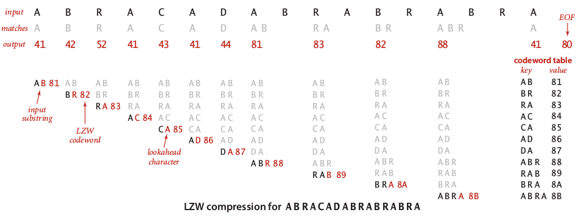
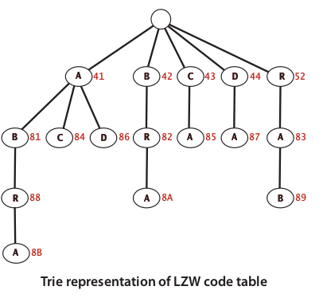
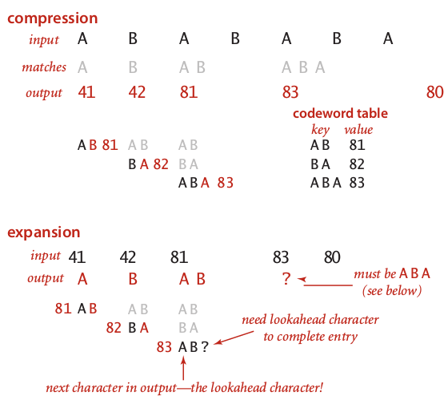

## LZW Compression {#lzw-compression}

LZW try to improve encoding performance by creating table lookup for next prefix of character. A encoding technique is very simple but powerful. Step by step LZW compression explained below:

1.  Use standard encoding table to encode each character, for example ASCII.

2.  Decide a **stop code** use to indicate delimiter or space. For example 80.

3.  Allocate a symbol table (key - value) to store prefix encoding.

4.  Scan each input character until we found **longest prefix.**

5.  If we found new longest prefix, then stored in into symbol table with 8-bit value. For example, prefix AB with code 81.

6.  Else we encode each discovered longest prefix with codeword value in the symbol table.

7.  Repeat step 4 until all character have been scanned.

An image below illustrate how to compress text _ABRACADABRA_using LZW compression

For efficiency, we store table of codewords as a **Trie Symbol Table**(**TST**).

If we know the stop code used for compression, it is easy to decompress the LZW compressed bits. The step-by-step to do decompressing or expand is similar to compressing scheme. But, there is a tricky technique in the case to avoid stuck while constructing symbol table. For example, in the case to decompress text _ABABABA_ with compressed bitstream _41 42 81 83 80_, we need to ensure that codeword 83 is a prefix ABA. The decompressing process of text _ABABABA_ illustrated in an image below.

The implementation of LZW compression over 8-bit extended ASCII alphabet with 12-bit codewords using java will be looked like this:

public class LZW {

private static final int R = 256;

private static final int L = 4096;

private static final int W = 12;

private LZW() {}

public static void compress() {

String input = BinaryStdIn.readString();

TST

**Illegal HTML tag removed :** st = new TST<integer>();</integer>

for (int i = 0; i &lt; R; i++)

st.put(“” + (char) i, I);

int code = R+1;

while (input.length() &gt; 0) {

String s = st.longestPrefixOf(input);

BinaryStdOut.write(st.get(s), W);

int t = s.length();

if (t &lt; input.length() &amp;&amp; code &lt; L)

st.put(input.substring(0, t + 1), code++);

input = input.substring(t);

}

BinaryStdOut.write(R, W);

BinaryStdOut.close();

}

public static void expand() {

String[] st = new String[L];

int i;

for (i = 0; i &lt; R; i++)

st[i] = “” + (char) i;

st[i++] = “”;

int codeword = BinaryStdIn.readInt(W);

if (codeword == R) return;

String val = st[codeword];

while (true) {

BinaryStdOut.write(val);

codeword = BinaryStdIn.readint(W);

if (codeword == R) break;

String s = st[codeword];

if (i == codeword) s = val + val.charAt(0); // Special case

if (i &lt; L) st[i++] = val + s.charAt(0);

val = s;

}

BinaryStdOut.close();

}

public static void main(String[] args) {

if (args[0].equals(“-”)) compress();

else if (args[0].equals(“+”)) expand();

else throw new IllegalArgumentException(“Illegal command line”);

}

}